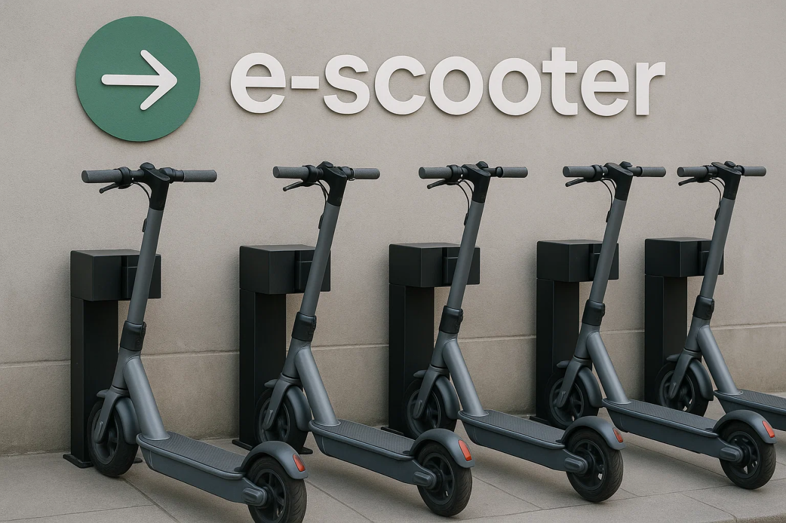

# Easy Scooter 共享滑板车租赁平台



## 1. 功能

Easy Scooter 是一个面向家庭式共享滑板车店铺的智能租赁管理平台。该平台集成了现代化的移动应用、后端服务和智能客服系统，为小型滑板车租赁店铺提供完整的数字化解决方案。

### 项目概述

Easy Scooter 平台旨在帮助小型滑板车租赁店铺实现数字化转型，通过智能化的管理系统提升运营效率，改善用户体验。平台支持多端访问，包括移动应用（Android/iOS）、网页版和桌面版（Windows），满足不同场景下的使用需求。

### 应用场景

- 家庭式滑板车租赁店铺
- 小型共享滑板车运营商
- 旅游景区滑板车租赁服务
- 校园内滑板车共享服务

### 应用界面展示

#### 登录界面


#### 主页地图界面


#### 个人中心界面


#### 智能客服对话界面


> 注：以下界面截图待添加：
> 1. 滑板车详情界面
> 2. 支付界面

### 核心功能

#### 🛴 滑板车管理
- 实时滑板车位置追踪
- 滑板车状态监控（可用、使用中、维护中）
- 滑板车评分和评价系统
- 智能调度和分配

#### 💳 支付系统
- 多支付卡管理
- 安全的支付卡存储
- 默认卡设置
- 支付验证和确认
- 自动计费和结算

#### 👤 用户管理
- 用户注册和登录
- 个人信息管理
- 头像上传和压缩
- 本地数据同步
- 用户信用评级

#### 📝 租赁管理
- 创建和管理租赁记录
- 查看租赁历史
- 实时租赁状态追踪
- 费用计算和支付处理
- 自动续租提醒

#### 💬 智能客服
- 实时聊天界面
- 智能问题解答
- 用户指南和提示
- 消息历史管理
- 多语言支持（中文、英文）

#### 📱 其他功能
- 二维码扫描解锁
- 基于位置的服务
- 设备权限管理
- 多语言支持
- 实时通知系统

## 2. 项目结构(部分)

```
├── frontend/                # Flutter 前端应用
│   ├── lib/                # 主要源代码
│   │   ├── components/     # 可复用UI组件
│   │   ├── models/        # 数据模型
│   │   ├── pages/         # 应用页面
│   │   ├── providers/     # 状态管理
│   │   ├── services/      # API服务
│   │   └── utils/         # 工具函数
│   ├── test/              # 测试文件
│   └── assets/            # 资源文件
│
├── backend/               # FastAPI 后端服务
│   ├── app/              # 主应用目录
│   │   ├── api/          # API路由
│   │   ├── core/         # 核心配置
│   │   ├── db/           # 数据库配置
│   │   ├── models/       # 数据库模型
│   │   └── schemas/      # 数据验证
│   ├── tests/            # 测试文件
│   └── alembic/          # 数据库迁移
│
└── model/                # 智能客服系统
    ├── config/           # 配置文件
    ├── schema/           # 数据模式
    └── chroma_database/  # 向量数据库
```

## 3. 如何启动

### 前端启动

1. 安装 Flutter SDK（>=2.19.4）
2. 进入前端目录：
```bash
cd frontend
```
3. 安装依赖：
```bash
flutter pub get
```
4. 运行应用：
```bash
# 开发模式
flutter run

# 发布模式
flutter run --release

# Windows版本
flutter run -d windows

# Web版本
flutter run -d chrome
```

### 后端启动

1. 安装 Python 3.8+
2. 进入后端目录：
```bash
cd backend
```
3. 创建虚拟环境：
```bash
python -m venv venv
source venv/bin/activate  # Linux/Mac
venv\Scripts\activate     # Windows
```
4. 安装依赖：
```bash
pip install -r requirements.txt
```
5. 配置环境变量（复制 .env.example 到 .env 并修改）
6. 启动服务：
```bash
uvicorn app.main:app --reload --host 0.0.0.0 --port 8222
```

### 使用 Docker 启动（推荐）

1. 安装 Docker 和 Docker Compose
2. 在后端目录下运行：
```bash
docker-compose up -d
```

### 智能客服启动

1. 进入模型目录：
```bash
cd model
```
2. 创建虚拟环境：
```bash
python -m venv venv
source venv/bin/activate  # Linux/Mac
venv\Scripts\activate     # Windows
```
3. 安装依赖：
```bash
pip install -r requirements.txt
```
4. 配置 Qwen API 密钥（在 config/config.py 中）
5. 启动服务：
```bash
python server.py
```

## 4. 如何确认启动成功

### 前端验证
1. 应用成功启动后，会显示登录界面
2. 检查以下功能是否正常：
   - 用户注册/登录
   - 滑板车列表加载
   - 地图显示
   - 二维码扫描
   - 支付功能

### 后端验证
1. 访问 API 文档：
   - Swagger UI: http://localhost:8222/docs
   - ReDoc: http://localhost:8222/redoc
2. 检查健康状态：
   - 访问 http://localhost:8222/api/v1/health
   - 应返回 {"status": "healthy"}

### 数据库验证
1. 检查数据库连接：
   - 使用 psql 连接数据库（端口 5438）
   - 用户名：postgres
   - 密码：password
   - 数据库名：rental_platform

### 智能客服验证
1. 访问客服 API：
   - 端点：http://119.45.26.22:3389/qwen
2. 发送测试消息验证响应：
```json
{
  "uid": "test_user",
  "cid": "test_conversation",
  "status": 0,
  "query": "你好",
  "history_chat": []
}
```

### 完整功能验证清单
- [ ] 用户注册和登录
- [ ] 滑板车列表显示
- [ ] 地图定位功能
- [ ] 支付系统
- [ ] 租赁流程
- [ ] 智能客服响应
- [ ] 实时通知
- [ ] 数据同步

如果以上所有检查项都通过，说明系统已经成功启动并正常运行。
